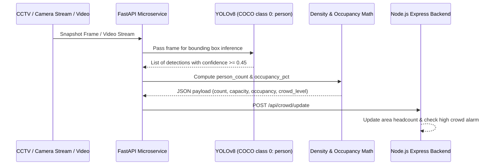

# AI & Machine Learning Computer Vision Workflow

## 1. Overview
The Computer Vision microservice estimates human crowd density across temple holding bays, sanctum pathways, and entrance gates using **YOLOv8** object detection and geometric occupancy calculations.

---

## 2. Detection Pipeline

---

## 3. Mathematical Calculations

### Occupancy Percentage Formula:
$$\text{Occupancy Pct} = \left( \frac{\text{detected\_people}}{\text{area\_capacity}} \right) \times 100$$

### Density Tiers:
| Density Tier | Occupancy Percentage Range | Queue Action |
| :--- | :--- | :--- |
| **LOW** | $0\% - 44.9\%$ | Standard continuous queue flow |
| **MODERATE** | $45.0\% - 74.9\%$ | Alert staff to monitor batch progression |
| **HIGH** | $\ge 75.0\%$ | Trigger `highCrowdWarning`, throttle gate check-in, alert marshals |

---

## 4. Zero-Hardware Prototype Simulation Mode
To ensure the project functions reliably during college viva and evaluation even without external IP camera hardware, the detector includes an automatic **Computer Vision Synthetic Stream Generator** that produces realistic footfall variations and simulated bounding boxes, clearly labelled as demo data in API responses.
