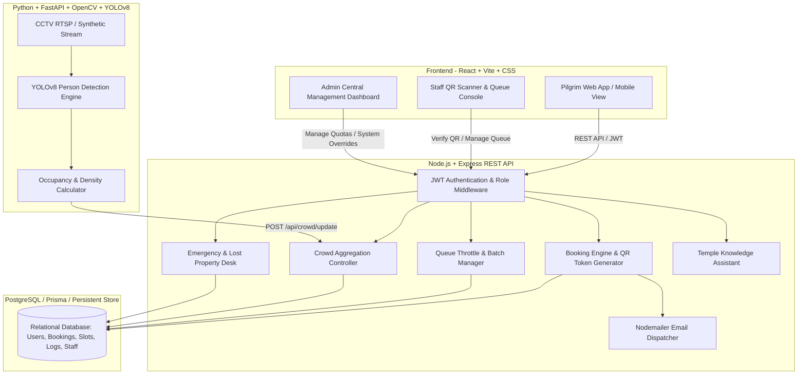

# System Architecture & Technical Design

## "Smart Temple Management & Pilgrim Flow System"

### 1. High-Level System Architecture

---

### 2. Core Project Workflow & Storyline (For Viva & Presentation)

$$\text{Pilgrim} \longrightarrow \text{Book Darshan} \longrightarrow \text{Generate QR Token} \longrightarrow \text{Gate Scanner Verification} \longrightarrow \text{YOLO Crowd Vision Monitor} \longrightarrow \text{Queue Throttle} \longrightarrow \text{Admin Oversight}$$

1. **Pilgrim Booking**: Pilgrim registers, selects date, darshan category, and time slot. System auto-generates a unique Booking ID (`DAR-YYYY-XXXXXX`) and a secure non-sensitive QR token.
2. **Email & Confirmation**: Automated confirmation email and digital entry pass dispatched to the pilgrim.
3. **Gate Entry Check-in**: Ground staff scans QR code or enters code via `/staff/qr-scanner`. System validates against double check-in, marks entry completed, and prevents fraud.
4. **AI Crowd Vision Monitoring**: FastAPI microservice runs YOLOv8 person detection on temple holding bay cameras to compute real-time headcounts, occupancy percentages, and crowd tiers (`LOW`, `MODERATE`, `HIGH`).
5. **Smart Queue Regulation**: If holding bay occupancy exceeds 75%, system flags `highCrowdWarning`, dynamically slows batch calls, and alerts staff.
6. **Executive Dashboard**: Administrator monitors real-time CCTV feeds, slot utilization, staff assignments, festival surges, emergency incidents, and exports audit compliance reports in CSV format.
